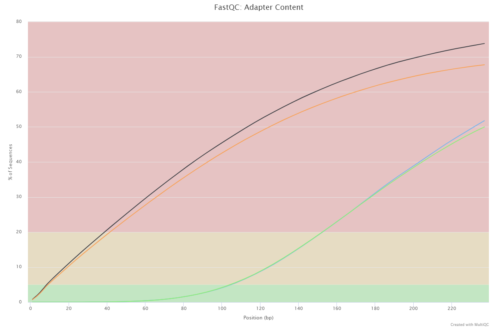
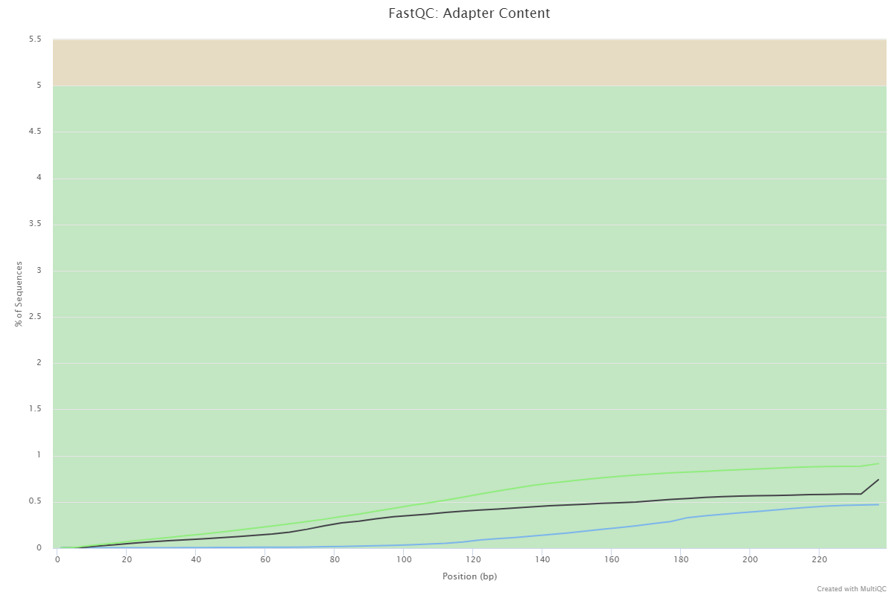

# Задание 1
## Список всех команд, которые были выполнены на сервере
```
ln -s /usr/share/data-minor-bioinf/assembly/oil_R1.fastq
ln -s /usr/share/data-minor-bioinf/assembly/oil_R2.fastq
ln -s /usr/share/data-minor-bioinf/assembly/oilMP_S4_L001_R1_001.fastq
ln -s /usr/share/data-minor-bioinf/assembly/oilMP_S4_L001_R2_001.fastq

seqtk sample -s307 oil_R1.fastq 5000000 > pe1.fastq
seqtk sample -s307 oil_R2.fastq 5000000 > pe2.fastq
seqtk sample -s307 oilMP_S4_L001_R1_001.fastq 1500000 > mp1.fastq
seqtk sample -s307 oilMP_S4_L001_R2_001.fastq 1500000 > mp2.fastq

mkdir fastqc && fastqc pe1.fastq pe2.fastq mp1.fastq mp2.fastq -o fastqc
mkdir multiqc && multiqc fastqc -o multiqc
cp multiqc/multiqc_report.html multiqc_full.html

platanus_trim pe1.fastq pe2.fastq
platanus_internal_trim mp1.fastq mp2.fastq

rm -rf mp1.fastq mp2.fastq pe1.fastq pe2.fastq fastqc multiqc

mkdir fastqc && fastqc pe1.fastq.trimmed pe2.fastq.trimmed mp1.fastq.int_trimmed mp2.fastq.int_trimmed -o fastqc
mkdir multiqc && multiqc fastqc -o multiqc
cp multiqc/multiqc_report.html multiqc_trimmed.html

platanus assemble -f *.trimmed
platanus scaffold -c out_contig.fa -IP1 *.trimmed -OP2 *.int_trimmed
platanus gap_close -c out_scaffold.fa -IP1 *.trimmed -OP2 *.int_trimmed

mkdir hse21_hw1/multiqc && cp multiqc*.html hse21_hw1/multiqc
mkdir hse21_hw1/data
cp out_gapClosed.fa hse21_hw1/data/scaffolds.fasta
cp out_contig.fa hse21_hw1/data/contigs.fasta
```

## Скриншоты и статистика из файлов multiQC
### [Исходные чтения](multiqc/multiqc_full.html)


### [Подрезанные чтения](multiqc/multiqc_trimmed.html)

